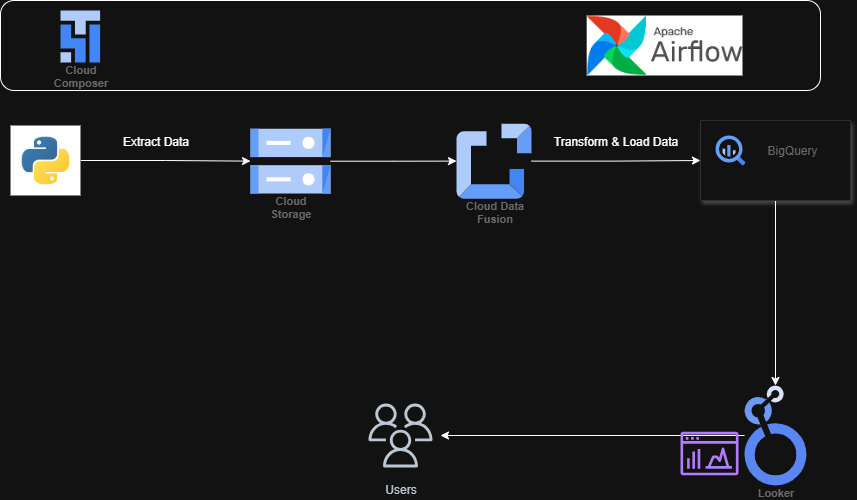
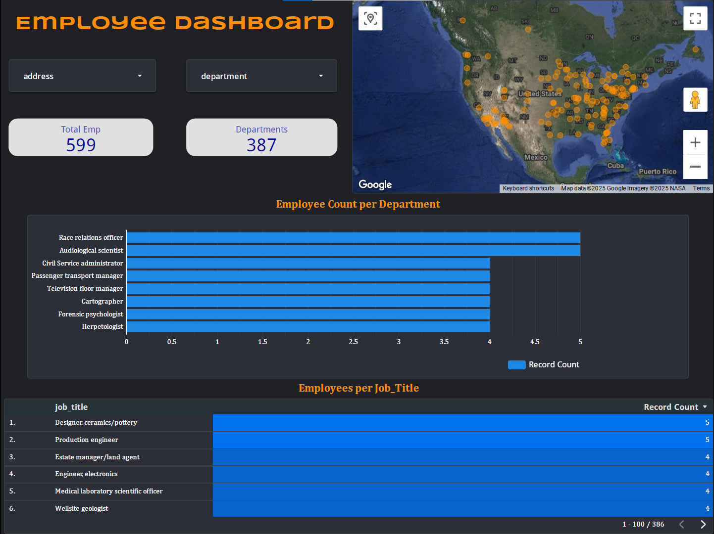

# ETL Project with Data Fusion, Airflow, and BigQuery

This repository contains code and configuration files for an **Extract, Transform, Load (ETL)** project using:

- **Google Cloud Data Fusion** for transformation  
- **Apache Airflow (Cloud Composer)** for orchestration  
- **Google BigQuery** for data loading  
- **Python** for data extraction  

---

## Overview

The project aims to perform the following tasks:

1. **Data Extraction**: Generate and extract sample employee data using Python and Faker.  
2. **Data Masking**: Apply masking & encoding techniques to sensitive information in Cloud Data Fusion before loading it into BigQuery.  
3. **Data Loading**: Load the transformed data into Google BigQuery tables.  
4. **Orchestration**: Automate the complete data pipeline using Airflow (Cloud Composer).  
---

## Architecture



---

## Setup Instructions

## 1. Install Dependencies

1. To install **Faker** for generating fake employee data:
```bash
pip install faker
```
2. To install **Google Cloud Storage client** library:
```bash
pip install google-cloud-storage

```
3. Authenticate with Google Cloud
```bash
gcloud auth application-default login
```

## Execution Flow

Run Python Extract Script → Generates employee_data.csv and uploads it to your GCS bucket.

Data Fusion Pipeline → Reads data from GCS, applies masking/transformations, and loads it into BigQuery.

Airflow DAG → Orchestrates the above steps inside Cloud Composer.


## DashBoard 

DashBoard pdf : `Employee Dashboard-looker.pdf`